# Adding a trainable pre-processing to U-Net

## Goals
Since the advent of deep learning, the task of segmentation has become one of the principle vision tasks, with applications in the medical field (to segment bones, tissue, amongst many others) all the way too applications in environmental planning, disaster management, and autonomous vehicles. In this blog post, we discuss our attempts at improving a well known network used for segmentation: the U-Net, which will be further discussed in the architecture section. The U-Net has become an eponymous network, and has shown promising results across a variety of segmentation tasks. Originally made and trained in order to do segmentation on medical images [add precision] [2], it has also been used to 'lighten' dark images [4]. The specific segmentation task at hand concerns the Cityscapes dataset [5], a well known urban scenes dataset. More specifically, we work with the gtFine dataset (roughly XXXXX images). Our aim is to hopefully improve the segmentation results of the U-Net by adding a network at the front (to preprocess the data) and hopefully improve the performance (accuracy) of the U-Net. Our motivation stems from the inspiration drawn from the GenISP network introduced in reference [1]. This network aims to enhance the interpretability of images for subsequent processing by the network. Similarly, we seek to improve the segmentation results by augmenting the U-Net with a pre-processing network that can make the input data more informative and conducive to accurate segmentation.

By incorporating a trainable pre-processing network, we aim to enhance the U-Net's ability to effectively capture and interpret the features relevant to urban scene segmentation. Through this approach, we aspire to achieve improved performance in terms of segmentation accuracy, thereby advancing the capabilities of the U-Net and contributing to the broader field of computer vision and image analysis.
  
## Motivations

### Advancing the Field through Experimentation
Deep learning networks have demonstrated remarkable capabilities in various tasks, yet the underlying mechanisms that drive their performance often remain elusive. To advance the field and gain deeper insights into these networks, experimentation plays a crucial role. By exploring new approaches, modifications, and combinations of established architectures, researchers can uncover novel techniques that improve performance and expand the boundaries of what is achievable. In this regard, we propose to use a pre-network similar to the network used in [1], in order to see if images become more readable to a classical U-Net architecture.

### Significance of Segmentation in Image Processing

Segmentation serves as a foundational concept in numerous image processing applications, enabling the extraction of meaningful information from visual data. The ability to accurately delineate and classify objects within an image is crucial for tasks such as object recognition, scene understanding, and image-based decision-making systems. Among the various segmentation architectures, the U-Net stands out for its remarkable performance and has proven to have wide-spread applications (as discussed above).

### Leveraging the U-Net's Track Record
The U-Net has established itself as an influential network in the field of segmentation. With its proven track record of success across diverse segmentation tasks, it offers a solid foundation for further exploration. By using it as a baseline segmentation network, we can explore whether pre-processing the input has any significant difference on the networks ability to perform segentation in an urban scenery environment.

### Exploring Urban Scenery Segmentation
Urban scenes pose unique challenges for segmentation algorithms due to their complexity and diverse elements such as buildings, roads, vehicles, and pedestrians. The Cityscapes dataset provides an excellent opportunity to delve into the segmentation of urban scenes and evaluate the U-Net's performance in this context. 
<!-- 
### Investigating Potential Results
The motivation behind our work lies in the intriguing potential for achieving significant advancements by combining experimentation with the U-Net architecture. By conducting experiments and analyzing the results obtained from the U-Net on urban scenery, we aim to unravel the network's behavior, explore its strengths and weaknesses, and identify potential areas for improvement. The promising results previously achieved by the U-Net across a range of segmentation tasks make it a compelling choice for investigation, and we believe that exploring its performance in the domain of urban scene segmentation will yield valuable insights. -->

<!-- ### A Promising Lead?
Through our exploration of the U-Net architecture in the context of urban scene segmentation, we strive to push the boundaries of knowledge in the field of computer vision and image processing. By gaining a deeper understanding of the network's behavior and its suitability for complex segmentation tasks, we can contribute to the development of more accurate and robust segmentation techniques. Ultimately, our efforts aim to advance the capabilities of segmentation networks, enabling breakthroughs in various applications such as medical imaging, autonomous vehicles, and urban planning. -->

- Why we did what we did?
- What are we trying to achieve?

## Architecture
For this implementation we attempted to connect two different architectures together. The first is a trainable pre-processing pipeline that was used in the past by [1] order to attempt the make object detectors see better in the dark. The second architecture is a vanilla [2] U-Net that we trained in semantic segmentation with the Cityscapes dataset [3]. The goal of this architecture is to improve the performance of the U-Net by pre-processing the images in a way that makes it easier for the U-Net to segment the images.

The output of the pre-processing pipeline is a new image that is then fed into the U-Net.
These 2 architectures are connected in the following way:
```python
output1 = PreNet(imagergb)
output2 = F.pad(input=output1, pad=(2, 2, 2, 2))
output = UNet(output2)
```
- Explain how the 2 architectures connect

### Pre-Net [1]
<figure>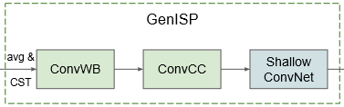<figcaption align = "center"><b>Pre-processing pipeline overview</b></figcaption></figure>
<figure>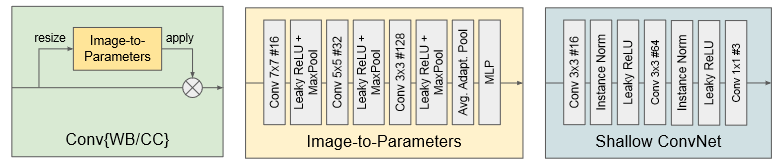<figcaption align = "center"><b>Diagram of the block in the pre-processing</b></figcaption></figure>
For our pre-processing pipeline we have taken inspiration from the Proposed pre-processing pipeline from [1].

````python
    def forward(self, batch_input):
        N, C, H, W = batch_input.shape              # Save the old dimensions
        
        # Create the WhiteBalance correction matrix from the sub-network and apply it to the (non-resized) image(s)
        whitebalance = self.convWB(batch_input)
        batch_input = torch.bmm(whitebalance, batch_input.view(N, C, H*W)).view(N, C, H, W)

        # Create the ColorCorrection matrix from the sub-network and apply it to the (non-resized) image(s)
        colorcorrection = self.convCC(batch_input)
        batch_input = torch.bmm(colorcorrection, batch_input.view(N, C, H*W)).view(N, C, H, W)
        return self.shallow(batch_input)
````

It consists of several layers of convolutions, Leaky ReLU together with Max pooling, and ending in a Multi Layer Perceptron (MLP) layer. This MLP layer is the only thing that makes the ConvWB and ConvCC blocks different, as they have a different number of outputs (3 and 9 respectively).These outputs are then applied to the pixel values of the image in the following way
<figure>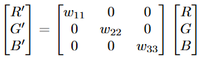<figcaption align = "center"><b>How the output of the ConvWB block is applied to the colors of the image</b></figcaption></figure>

<figure>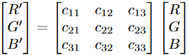<figcaption align = "center"><b>How the output of the ConvCC block is applied to the colors of the image</b></figcaption></figure>

Finally the new image is fed into the Shallow ConcNet block and the output is then a new image that should be easier for U-Net to preform image segmentation on.
### U-Net
For the main backbone of our architecture we used a U-Net network that was trined for the task of image segmentation. The architecture goes 4 encoders deep before a bottleneck layer and then 4 decoders. In the forward pass of the network each encoder is connected to both the following decoder and the next encoder. To the next encoder the convolution output is fed into it's decoder while the pooled output of the convolution is fed to the next encoder.

````python
    def forward(self, x):
        # Encoder
        enc1, x = self.encoder1(x)
        enc2, x = self.encoder2(x)
        enc3, x = self.encoder3(x)
        enc4, x = self.encoder4(x)

        # Bottleneck
        x = self.bottleneck(x)

        # Decoder
        x = self.decoder1(x, enc4)
        x = self.decoder2(x, enc3)
        x = self.decoder3(x, enc2)
        x = self.decoder4(x, enc1)

        # Classifier
        outputs = self.outputs(x)

        return outputs
````
The encoders as can be seen in the code snipet bellow are comprised of a convolutional block and a max pooling layer. The decoders are comprised of a transpose convolutional layer and a convolutional block. The bottleneck layer is a simple convolutional block.

````python
class encoder_block(nn.Module):
    def __init__(self, in_c, out_c):
        super().__init__()

        self.conv = conv_block(in_c, out_c)
        self.pool = nn.MaxPool2d(kernel_size=2, stride=2)

    def forward(self, inputs):
        x = self.conv(inputs)
        p = self.pool(x)

        return x, p


class decoder_block(nn.Module):
    def __init__(self, in_c, out_c):
        super().__init__()

        self.up = nn.ConvTranspose2d(in_c, out_c, kernel_size=2, stride=2)
        self.conv = conv_block(in_c, out_c)

    def forward(self, inputs, skip):
        x = self.up(inputs)
        x = torch.cat([x, skip], dim=1)
        x = self.conv(x)

        return x
````
The architecture is shown in the following figure. 
<figure><figcaption align = "center"><b>Structure a similar U-Net network, not representative of ours, added for clarity sake</b></figcaption></figure>

## Training Procedure
- How did we train it?
- What experiment did we run?
- Why did we run the experiment we did?
- What weights did we use?

At first we trained the UNet for 10 epochs with the Cityscapes dataset. After the training we extracted the weights of the trained network in the 'model.pth' file. The idea as mentioned above is to use the PreNet (GenISP) network before the pretrained vanilla U-Net hoping that with the pre-processing network we will make the data easier segmentable for the UNet.
Subsequently, in order to train the final pipeline, we load the weights of the pre-trained vanilla U-Net from the 'model.pth' file and we freeze the U-Net parameters setting the parametes' <em>requires_grad</em> parameter to False so that the U-Net parameters will not train again as it is already pre-trained.

```python 
for param in UNet.parameters():
    param.requires_grad = False # Freeze the UNet weights
```

We set the input parameters like epochs (10) and learning rate (0.0001) which turned out to be the optimal and more stable after parameter tuning. The number of input channels are 3 as they represent the three channels (R, G, B). We initialize the parameters of the GenISP network as adviced in previous research papers that created it. We decided to run the loops on the cuda GPU, because of its much higher parallel performance in order to processing epochs faster.

The training loop performs the forward and backward passes of the network. The input data is fed to the PreNet and the output of the PreNet is the fed to the pre-trained U-Net model after some adjustments in the size using padding.

## Results - Training Set
In this section we will outline the results obtained via the experiments on the trainin set. The results break down into 2 comparable cases: the loss and average accuracy for the U-Net alone, and then for the U-Net with frozen weights, and the pre-net as a pre-processing unit.  

For the results on the testing set, see the section below.

### Dataset
The dataset used is the Cityscapes dataset, downloaded directly from the Cityscapes website. We use the "gtFine" dataset, which consists of 3475 train images, and 1525 test images. 

Before diving into the graphs and numbers, we propose to look at how the network improves on segmentation from a visual perspective. An important note is that each network was trained for 10 epochs, which roughly corresponded to 20 minutes of training time, the networks were trained on a GPU, namely, a GTX 1080 Ti, using PyTorch. 

A batch size of 8 was used for all training. 

### U-Net
The first output of the U-Net is (as one would expect) not very impressive. However, we would still like to highlight it as it shows that the network is clearly learning to segment. In the figure below, on the left hand side is the network output, right hand side is ground truth.

<figure>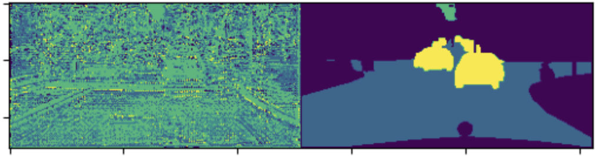<figcaption align = "center"><b>Epoch 1, output from the U-Net, Loss: 1.4606</b></figcaption></figure>

After 10 epochs, the network produces the following segmentation map:
<figure>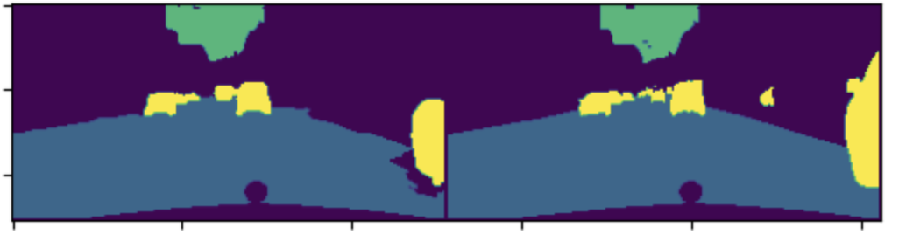<figcaption align = "center"><b>Epoch 10, output from the U-Net, Loss: 0.097</b></figcaption></figure>

Clearly, the U-Net is performiing generally well, given the fact that it is only traned for 10 epochs. We can see that the network output (left) has a region that is not correctly segmented to the right of the image, around the contour of the car. We also see the car itself is not properly segmented.


<figure>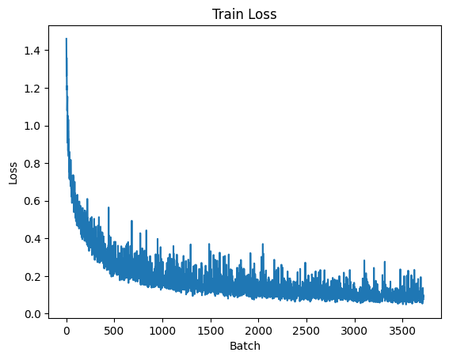<figcaption align = "center"><b>U-Net loss after 10 epochs</b></figcaption></figure>

It is worth stating again, that given the short training time/number of epochs, one can safely assume that the network would eventually improve on these minor areas, however, extensive training was considered to be out of the scope of this project, since we are drawing a comparison between two architectures, we were mostly interested in the shape of the loss curve, and the accuracy.

Finally, looking at the average accuracy, the U-Net alone reaches an accuracy of 0.9706.

### Pre-Net with U-Net
At this point in time, we have a trained U-Net on an urban scenery data segmentation task. The next objective is to freeze the weights of the trained U-Net, which we do as follows:

```python 
for param in UNet.parameters():
    param.requires_grad = False # Freeze the UNet weights
```

We are now able to pass the image through the pre-net before passing it to the U-Net. To reiterate, this idea is inspired from [1], where the authors use a pre-net in order to do some form of early processing on the image in order to achieve better performance on the main model. 

With this in mind, we propose to evaluate the results in a way consistent with how we evaluated the U-Net results: namely, examine the output at the first epoch, and the last epoch, while looking at the average accuracy and loss.

<figure>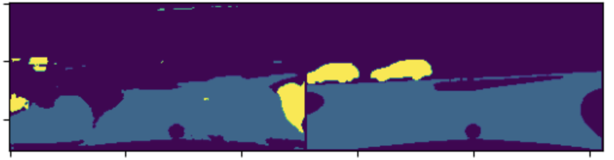<figcaption align = "center"><b>Epoch 1, output from the Pre-Net, Loss: 0.404</b></figcaption></figure>

From the figure above, we can see that the network is clearly doing _something_ when it comes to segmenting, but this is almost certainly due to the already traine U-Net. 

However, the results get slightly more interesting after 10 epochs: 

<figure>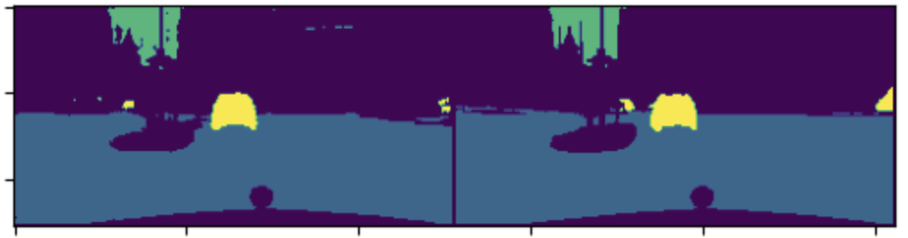<figcaption align = "center"><b>Pre-Net loss after 10 epochs, Loss: 0.0994</b></figcaption></figure>

As we can see, the segmentation maps here are almost identical, more so than the output of the U-Net alone. Comparing other outputs, it seems like the network is learning each class at a slow rate, where the networks seems to first learn to segment the foreground (see figure from epoch 1), and then the background, as illustrated above. As a result, we can posit that perhaps 10 epochs was a sub-optimal training duration. 

The training loss curve is given below:

<figure>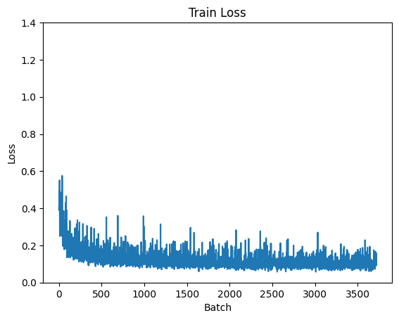<figcaption align = "center"><b>U-Net loss after 10 epochs</b></figcaption></figure>

Note that both loss curves for the U-Net and the U-Net with pre-net are at the same scale on the y-axis. The first aspect to comment on is that the initial loss is much lower for the combined network than for the U-Net alone, which one can assume is the  effect from the trained U-Net. The loss still converges, reaching roughly the same value as for the U-Net alone on the training set. 

The average accuracy for the training set with the combined network is 0.9638, meaning that this network is slightly less accurate than the U-Net alone. 

### Discussion
The first aspect to discuss is the results of the U-Net, which clearly seems to have satisfactory results after 10 epochs. This should not come as a surprise - as we mentioned earlier, the U-Net has a proven track record for segmentation tasks, as seen in publications such as [7]. However, when it comes to the Cityscapes dataset, we could not find any publications that used this specific combination, only a blog post on Medium had the same base setup, meaning the idea is somewhat novel, and yielding very satisfactory results, as illustrated in the segmentation map figures above.

The next part to discuss is the combination of a pre-net with the U-Net. It is obviously difficult to go into great details on the learning process of the network, since it is already working with a trained U-Net, meaning the baseline was already 'good'. A major aspect to discuss, is that with this approach, we run the risk of the pre-net simply learning to set all weights to 0, such that it effectively has no-effect on the already traine (and efficient) U-Net. Upon inspection, however, we notice that this is not the case. Extrapolating from this, the network is clearly learning _something_. This is also notable in the fact that after 10 epochs, the segmentation map seems to be better than the equivalent map from the U-Net, despite the accuracy and loss being somewhat comparable on average. 

To conclude, with only a limited number of training epochs, it is difficult to discuss whether this combination has an effect on imrpoving training. One aspect to note, is that this does add some flexibility to the network, however, the fact that there are 2 networks to train may deter some from adopting this method. 

keep to making sure we don't get penalized by this:
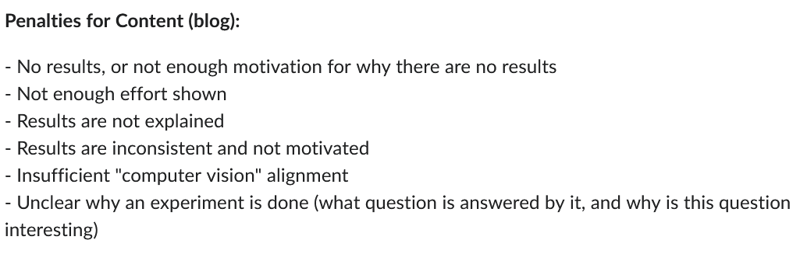
- What results did we get?
- Explain results
- Motivate results
- Why do we think it acts like that?
- How can they be interpreted?

## Results - Test Set

## Next Step
- Future work
    - train for more epochs!


# References:
[1] Morawski, I., Chen, Y. A., Lin, Y. S., Dangi, S., He, K., & Hsu, W. H. (2022). Genisp: Neural isp for low-light machine cognition. In Proceedings of the IEEE/CVF Conference on Computer Vision and Pattern Recognition (pp. 630-639).

[2] !TODO: Add U-Net reference

[3] Cordts, M., Omran, M., Ramos, S., Rehfeld, T., Enzweiler, M., Benenson, R., ... & Schiele, B. (2016). The cityscapes dataset for semantic urban scene understanding. In Proceedings of the IEEE conference on computer vision and pattern recognition (pp. 3213-3223).

[4] Learning to see in th edark [!TODO]


[5] Cityscapes dataset [!TODO]

[6] Pan, Zhuokun, et al. "Deep learning segmentation and classification for urban village using a worldview satellite image based on U-Net." Remote Sensing 12.10 (2020): 1574.

[7] Guo, Zhiling, et al. "Semantic segmentation for urban planning maps based on U-Net." IGARSS 2018-2018 IEEE International Geoscience and Remote Sensing Symposium. IEEE, 2018.